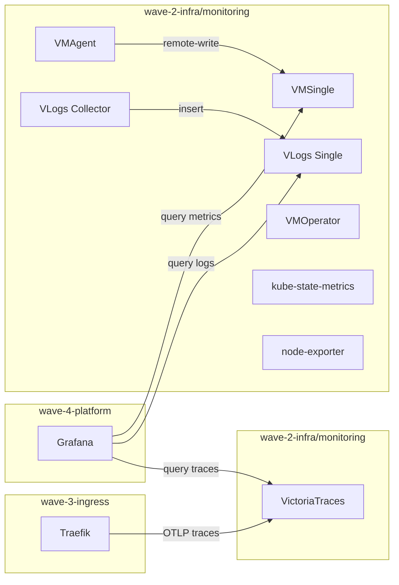

# Full Victoria Observability Stack

## Current State

The monitoring chart at [monitoring/Chart.yaml](clusters/platform/wave-2-infra/monitoring/Chart.yaml) deploys:

- `victoria-metrics-operator` (v0.58.1) -- manages VM CRDs
- `victoria-logs-collector` (v0.2.9) -- DaemonSet that ships logs to TrueNAS

Custom CRD templates create VMAgent, VMServiceScrape, and VMNodeScrape that **remote-write** to TrueNAS at `10.40.1.60:8428` (metrics) and `10.40.1.60:9428` (logs). No in-cluster storage exists.

## Target State

Everything runs in-cluster. TrueNAS VMSingle and VLogsSingle are decommissioned.

## Chart Dependencies

Replace [Chart.yaml](clusters/platform/wave-2-infra/monitoring/Chart.yaml) with 4 dependencies:

- `victoria-metrics-k8s-stack` (v0.72.4) aliased `stack` -- includes operator, VMSingle, VMAgent, kube-state-metrics, node-exporter, default scrape rules/dashboards
- `victoria-logs-single` (v0.11.26) aliased `vlogs` -- in-cluster VLogs server
- `victoria-logs-collector` (v0.2.9) aliased `log-collector` -- existing DaemonSet, re-targeted
- `victoria-traces-single` (v0.0.6) aliased `vtraces` -- in-cluster trace storage

## Key Values Decisions

### k8s-stack (`stack:`)

- `fullnameOverride: vm-stack` -- produces predictable service names: `vmsingle-vm-stack:8428`, `vmagent-vm-stack:8429`
- `argocdReleaseOverride: "monitoring"` -- required for correct VMServiceScrape label selection with ArgoCD
- `grafana.enabled: false` -- managed separately in wave-4-platform/grafana
- VMSingle: 14d retention, 50Gi on `truenas-nfs`, port 8428
- VMAgent: `selectAllByDefault: true`, labels `cluster=platform, runs-on=k8s`
- `vmalert.enabled: false`, `alertmanager.enabled: false` -- add later
- `kube-state-metrics.enabled: true`, `prometheus-node-exporter.enabled: true`
- Operator: `admissionWebhooks.enabled: false`, `disable_prometheus_converter: false`

### VLogs (`vlogs:`)

- `server.fullnameOverride: vlogs` -- service: `vlogs:9428`
- 7d retention, 20Gi on `truenas-nfs`
- VMServiceScrape enabled for self-monitoring

### VLogs Collector (`log-collector:`)

- Remote-write re-targeted: `http://vlogs.monitoring.svc.cluster.local:9428`
- Keeps `VL-Extra-Fields: cluster=platform` header

### VictoriaTraces (`vtraces:`)

- `server.fullnameOverride: vtraces` -- service: `vtraces:10428`
- 7d retention, 10Gi on `truenas-nfs`
- VMServiceScrape enabled for self-monitoring

## In-Cluster Service URLs

- Metrics: `http://vmsingle-vm-stack.monitoring.svc.cluster.local:8428`
- Logs insert: `http://vlogs.monitoring.svc.cluster.local:9428`
- Traces insert: `http://vtraces.monitoring.svc.cluster.local:10428/insert/opentelemetry/v1/traces`
- Traces query (Jaeger API): `http://vtraces.monitoring.svc.cluster.local:10428`

## Files to Modify

### 1. [monitoring/Chart.yaml](clusters/platform/wave-2-infra/monitoring/Chart.yaml) -- replace 2 deps with 4

### 2. [monitoring/values.yaml](clusters/platform/wave-2-infra/monitoring/values.yaml) -- full rewrite

All TrueNAS remote-write references (`10.40.1.60`) are replaced with in-cluster URLs.

## Files to Delete

### 3. [monitoring/templates/vmagent.yaml](clusters/platform/wave-2-infra/monitoring/templates/vmagent.yaml) -- k8s-stack creates VMAgent CRD automatically

### 4. [monitoring/templates/vmservicescrape.yaml](clusters/platform/wave-2-infra/monitoring/templates/vmservicescrape.yaml) -- k8s-stack includes apiserver + coredns scrape configs

### 5. [monitoring/templates/vmnodescrape.yaml](clusters/platform/wave-2-infra/monitoring/templates/vmnodescrape.yaml) -- k8s-stack includes kubelet + cadvisor scrape configs

## Files to Keep (no changes)

- [monitoring/templates/namespace.yaml](clusters/platform/wave-2-infra/monitoring/templates/namespace.yaml) -- privileged pod security labels still needed for log-collector DaemonSet
- [monitoring/app.yaml](clusters/platform/wave-2-infra/monitoring/app.yaml) -- `releaseName: monitoring`, `syncWave: "2"` unchanged

## Dependent Files to Update

### 6. [grafana/values.yaml](clusters/platform/wave-4-platform/grafana/values.yaml) -- update datasources

Changes:

- Metrics datasource URL: `http://10.40.1.60:8428` -> `http://vmsingle-vm-stack.monitoring.svc.cluster.local:8428`
- Add VictoriaLogs datasource: `http://vlogs.monitoring.svc.cluster.local:9428`, type `victoriametrics-logs-datasource`
- Add traces datasource (Jaeger): `http://vtraces.monitoring.svc.cluster.local:10428`
- Add `plugins` list: `victoriametrics-metrics-datasource`, `victoriametrics-logs-datasource`

### 7. [traefik/values.yaml](clusters/platform/wave-3-ingress/traefik/values.yaml) -- add OTLP tracing

Add `tracing` section pointing to `http://vtraces.monitoring.svc.cluster.local:10428/insert/opentelemetry/v1/traces`.

### 8. [migration.mk](makefiles/migration.mk) -- add monitoring validation to wave2

Add VMSingle, VLogs, VictoriaTraces pod checks and a decommissioning note for TrueNAS monitoring.

## Note on Risk 8 Update

The original migration plan (risk 8) stated "No action needed -- TrueNAS IPs remain stable." This is now superseded: all references to `10.40.1.60` are removed and replaced with in-cluster URLs. TrueNAS VMSingle/VLogsSingle can be decommissioned after validating the in-cluster stack.
